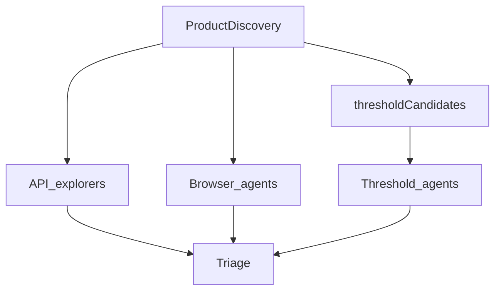

# Threshold Agent Lane Implementation Plan

> **For agentic workers:** Use subagent-driven-development or executing-plans task-by-task. Checkboxes track progress.

**Goal:** shoal に閾値探査の専用エージェント種別を追加し、UI／仕様から推論した境界をブラウザ主で踏んで finding を報告できるようにする。

**Architecture:** Product Discovery が `thresholdCandidates` を `ProductSpec` に格納 → run 時に優先度で割り当て → browser フェーズと並列に `runThresholdAgent` を起動（ブラウザ操作 + 任意の API 仕込み）→ 既存 `collectedFindings` / triage に合流。

**Tech Stack:** TypeScript, Playwright, 既存 agent-loop / product-discovery / vitest / Web ダッシュボード

## Global Constraints

- 思想: 「スクリプトでテスト」ではなく「限界を踏む体験として報告」
- MVP 成功条件: 境界付近のバグ／曖昧な失敗を finding 化（期待値突合・健全度スコアは後続）
- 操作: ブラウザ主・API 補助（`APP_TOOLS` があるときだけ仕込みに使う）
- 声: bug＝技術、ux＝体験（プロンプト指示）
- 優先度既定: `business` → `input` → `experience`（同 priority 内の tie-break もこの kind 順）
- 設定: `MAX_THRESHOLDS` デフォルト `1`、`0` で無効（コスト増を抑えるため既定は少数）
- ガード: 既存 `SHOAL_MODE` をそのまま適用
- パイプライン: explorers の直列構造は変えず、**browser エージェントと同一波で並列起動**
- エージェント実体: HR 採用不要の ephemeral ペルソナ（`Threshold Prober`）。roster / memory / セッション永続化はしない
- 型の置き場: `ThresholdCandidate` は [`framework/threshold.ts`](framework/threshold.ts) で定義し、`product-discovery.ts` から re-export または import（二重定義しない）
- 認証: ephemeral でも `planBrowserAuth` でテストアカウント／ログインを試みる（business 閾値はログイン後が多い）。セッションの `saveAgentSession` だけスキップ
- 古いキャッシュ spec: `thresholdCandidates` 欠落は `[]`。閾値レーンを有効化したい既存ユーザーは `REFRESH_SPEC=1` が必要（README に明記）

## Files

| File | Responsibility |
|---|---|
| `docs/superpowers/specs/2026-08-27-threshold-agent-design.md` | 合意デザインの仕様書 |
| `docs/superpowers/plans/2026-08-27-threshold-agent.md` | 本実装プランの永続コピー |
| [`framework/threshold.ts`](framework/threshold.ts) **(new)** | `ThresholdCandidate` 型・normalize・priority sort・割当 |
| [`framework/product-discovery.ts`](framework/product-discovery.ts) | spec フィールド / discovery プロンプト / パース時 normalize |
| [`framework/types.ts`](framework/types.ts) | `agentType: "threshold"` |
| [`run.ts`](run.ts) | `MAX_THRESHOLDS` / `runThresholdAgent` / browser と並列起動（browser ループを踏襲、大規模抽出はしない） |
| [`web/src/components/SwarmVisualizer.tsx`](web/src/components/SwarmVisualizer.tsx) | `TH` 種別 |
| [`framework/diary.ts`](framework/diary.ts) | ログパース／擬人化に threshold を追加 |
| [`server/runner.ts`](server/runner.ts) / [`server/index.ts`](server/index.ts) / [`server/mcp.ts`](server/mcp.ts) / StartModal + i18n | `maxThresholds` 配線 |
| [`server/__tests__/runner.test.ts`](server/__tests__/runner.test.ts) | env 渡しの回帰 |
| `.env.example` / README / README_JA | 設定・REFRESH_SPEC 注意 |
| `framework/__tests__/threshold.test.ts` ほか | 単体テスト |

---

## Task 0: 仕様書とプラン文書をコミット

- [ ] `docs/superpowers/specs/2026-08-27-threshold-agent-design.md` にブレインストーミング合意内容を書く（アーキテクチャ、データモデル、フロー、エラー、テスト、非スコープ、認証・キャッシュ方針）
- [ ] 自己レビュー: TBD／矛盾／曖昧さを潰す
- [ ] 同内容の実装プランを `docs/superpowers/plans/2026-08-27-threshold-agent.md` に保存
- [ ] Commit: `docs: add threshold agent design and plan`

---

## Task 1: `threshold` モジュール（TDD）

- [ ] `framework/__tests__/threshold.test.ts` を先に書く
  - 不正／欠落候補 → 空配列またはサニタイズ
  - sort: priority 昇順、同 rank なら business → input → experience
  - `assignThresholdCandidates(candidates, agentCount)`: 同一 `area` の重複割当を避けるラウンドロビン。`agentCount<=0` は空
- [ ] `framework/threshold.ts` を実装してテストを通す
- [ ] Commit: `feat: add threshold candidate normalize and assign helpers`

---

## Task 2: Product Discovery 拡張

- [ ] `ProductSpec` に `thresholdCandidates?: ThresholdCandidate[]` を追加（型は `threshold.ts` から import）
- [ ] `output_spec` ツールスキーマと discovery プロンプトに「制限・上限・境界」推論を追加（空配列可、候補は最大おおむね 8–12 に抑える旨をプロンプトで指示）
- [ ] パース時に `normalizeThresholdCandidates` を通し、古いキャッシュ欠落は `[]`
- [ ] `product-discovery.test.ts` に候補あり／なし／不正フィールドのケースを追加
- [ ] Commit: `feat: discover threshold candidates into ProductSpec`

---

## Task 3: `runThresholdAgent` とパイプライン接続

- [ ] [`framework/types.ts`](framework/types.ts): `agentType` に `"threshold"` を追加。影響テスト（report / runs）を更新
- [ ] [`run.ts`](run.ts):
  - `MAX_THRESHOLDS = parseInt(process.env.MAX_THRESHOLDS ?? "1", 10)`
  - `runThresholdAgent(...)` を追加（browser agent のツール実行ループを踏襲）
    - ログプレフィックス `[threshold]`
    - システムプロンプト: 割当候補一覧、`howToProbe`、カテゴリ別トーン、無理に finding を作らない、`SHOAL_MODE`、swarm signals
    - ツール: `BROWSER_TOOLS` と同系（API ツールは既存どおり `MAX_EXPLORERS>0` 時に付く）
    - `post_feedback` は既存の `collectedFindings` 経路に乗せる（triage 特別扱いはしない）
  - browser 起動ブロックで:
    - 候補が空 or `MAX_THRESHOLDS===0` → スキップログ
    - さもなくば ephemeral `Threshold Prober` を M 体用意し、`assignThresholdCandidates` で分配
    - 各 agent は `planBrowserAuth`（role は候補 area に紐づく明示 role がなければ roster/testAccounts の代表 role）→ guardrails →（任意）trace → `runThresholdAgent`
    - browser 群と **同一の `Promise.all` 波**で並列（別配列を concat して待つ）
    - `saveAgentSession` はしない；`runLog.agents` には `agentType: "threshold"` で push
- [ ] Commit: `feat: run threshold agents alongside browser lane`

---

## Task 4: UI / サーバー / ドキュメント

- [ ] SwarmVisualizer: `threshold` 色・`TH` ラベル・start/done 正規表現
- [ ] StartModal + i18n + `server/index.ts` + `server/runner.ts` + `server/mcp.ts` + runner テスト: `maxThresholds` → `MAX_THRESHOLDS`
- [ ] `diary.ts` の agent 行パースと擬人化（「限界探査係」など）
- [ ] `.env.example` / README.md / README_JA.md: `MAX_THRESHOLDS`、第3レーン説明、既存キャッシュは `REFRESH_SPEC=1` が必要な旨
- [ ] Commit: `feat: expose threshold agents in dashboard and docs`

---

## Task 5: 検証

- [ ] `npx vitest run` で関連テストすべて緑（threshold / product-discovery / runner / types 影響分）
- [ ] 可能なら `MAX_THRESHOLDS=1` の短い手動／結合確認（ログに `[threshold]`、Swarm に TH、finding が triage 入力に入る）
- [ ] 非スコープに触れていないことを確認

## Out of scope (explicit)

- `expectedBehavior` に基づく期待値判定
- 閾値健全度スコア / Experience Score 連携
- Hall での候補人手編集
- HR / Org Design による閾値ペルソナ採用
- ephemeral agent の memory / 再訪セッション
- `run.ts` からの browser 実行ループ大規模リファクタ
- explorers と browsers の実行順の大規模並列化再設計

## Review notes (folded into plan)

- 図の修正: 候補は threshold レーン専用（explorers/browsers への矢印を削除）
- auth を「同等」から「ログイン試行あり・セッション保存なし」に具体化
- `server/index.ts` の body 受け渡し漏れを Task 4 に追加
- 型の単一ソースを `threshold.ts` に固定
- 古い spec キャッシュと `REFRESH_SPEC` を制約＋README に明記
- memory/roster 非対象を Out of scope に明記
- discovery 候補数の上限をプロンプトで抑える（暴走防止）
